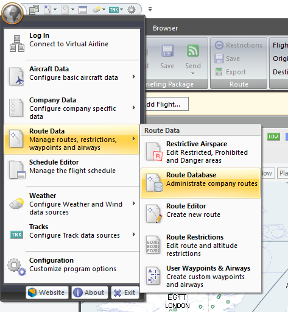
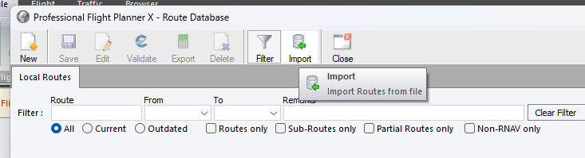
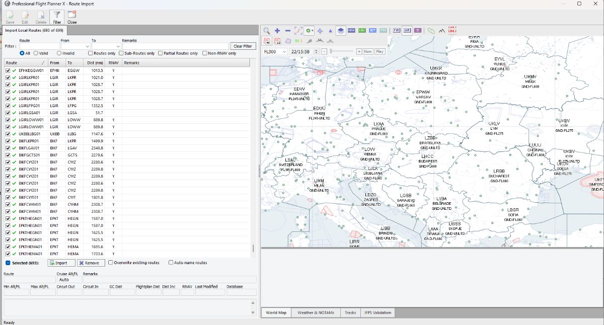
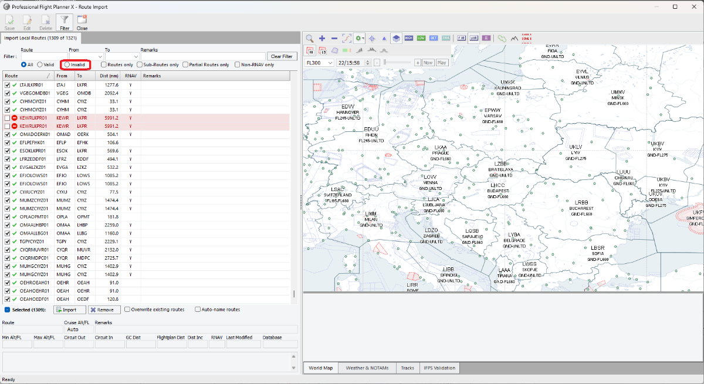
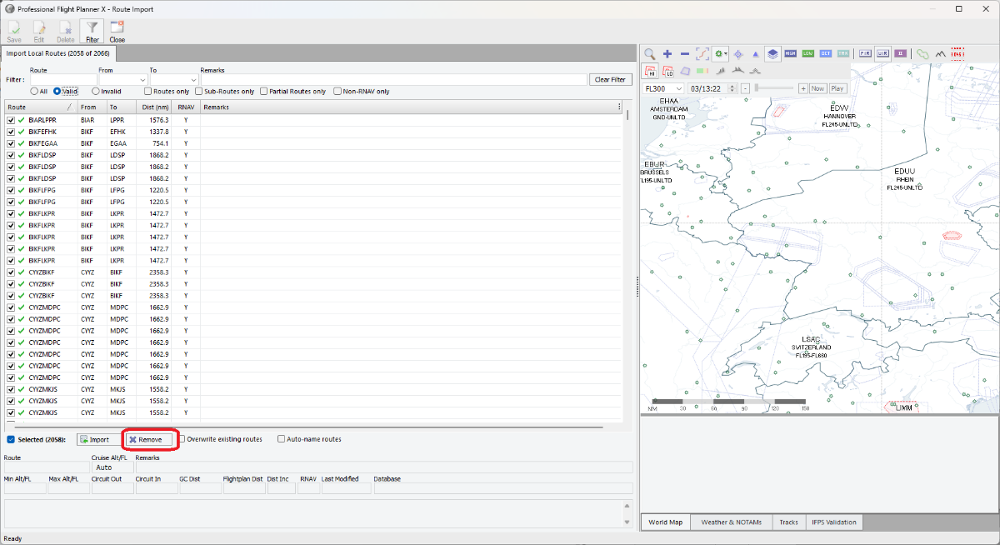
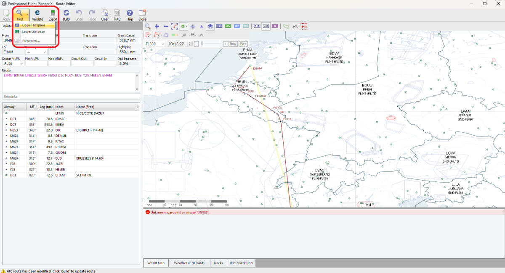
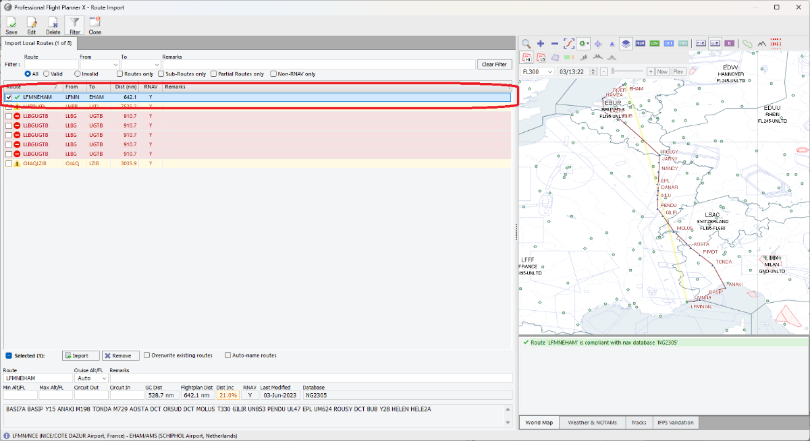

# Semi-automatic AIRAC validation of VA routes
Author: Jan Podlipský (TVS32) - jan.podlipsky@sw-virtual.eu
  
**Important notice: This guide has been made by the community, and vAMSYS team provides no support!**

## Prerequisites
- Own a copy of [PFPX](http://flightsimsoft.com/) (Download edition is enough, there is no need for a server subscription)
- Have a latest AIRAC installed in the PFPX (via Navigraph)
- I also recommend, in case you will be also creating routes in Europe with it, to install the [RAD](https://forum.aerosoft.com/index.php?/files/file/6626-pfpx-version-2-rad-restrictions-and-directs-2409/) for your AIRAC as well

## Guide

### Download your routes in the PFPX format
WIP

### Import the TXT file into PFPX
- Open the PFPX, click on the globe -> Route Data -> Route Database  
 
  
 
- Select Import  
 
  
 
- Import the saved .TXT file
- PFPX will then start the import of the routes, and will highlight any invalid routes  
 
  
 
- After the import is done, you can filter the Invalid routes  
 
  
 
### Remove the valid routes
- We can then get rid of the valid routes, because we don't need those. Simply select filter "Valid", then you should have all the valid routes selected, and just delete them  
 
  
 
- Now, when you switch into the filter "All", you can see all the invalid routes
### Update the routes right in this menu
- You can either just write down the invalid ones, and then generate new, however, you can also generate a new route right now in this window. SImply double-click on an invalid route  
 
  
 
- Then click on Build, and it will rewrite the route. Then alick on Apply, and it will update the route on the Import page  
 
  
 
- You may also export the finished routes in the Route databse, which will give you the routes in a text format, which may be further processed